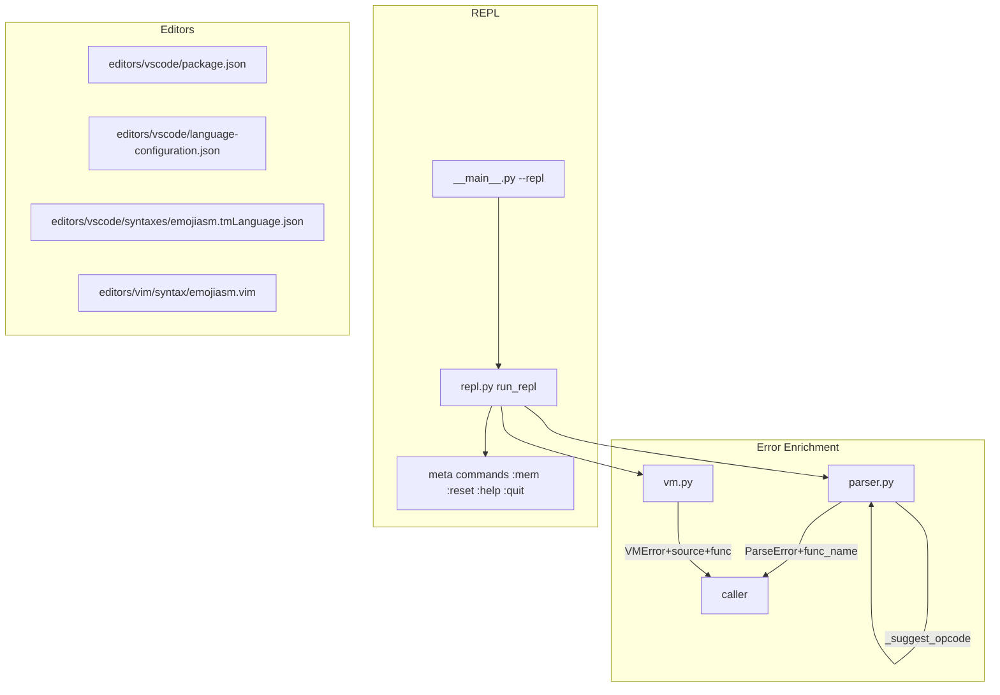

# Design: Developer Experience Improvements

## Overview

Three additive layers: (1) enriched error types in existing modules, (2) a new `repl.py` module, and (3) static editor files. No existing module APIs are broken; all signature changes use keyword-only defaults.

## Architecture



## Components

### _grapheme_truncate (parser.py)
**Purpose**: Return a grapheme-cluster-safe prefix of `s` at most `n` clusters long.

**Implementation notes**:
- Iterate over `s` codepoint by codepoint.
- Variation selectors (U+FE00–U+FE0F, U+20D0–U+20FF, U+E0100–U+E01EF) and combining marks (`unicodedata.combining(ch) != 0`) are attached to the preceding base — do not increment cluster count.
- Stop when cluster count reaches `n`.
- Append `...` suffix when truncation occurred.
- Pure stdlib, no imports beyond `unicodedata`.

### _suggest_opcode (parser.py)
**Purpose**: Given an unknown token, return a "did you mean X?" hint string or empty string.

**Implementation**:
```python
import difflib
candidates = list(EMOJI_TO_OP.keys())
matches = difflib.get_close_matches(token, candidates, n=1, cutoff=0.6)
return f" Did you mean: {matches[0]}?" if matches else ""
```

`cutoff=0.6` is a reasonable threshold; variation-selector differences score ~0.67 in SequenceMatcher since they share the base codepoint.

### ParseError (parser.py)
**Purpose**: Structured parse-time error with optional function context.

**Signature change** (backward-compatible):
```python
class ParseError(Exception):
    def __init__(self, message: str, line_num: int = 0, line: str = "",
                 func_name: str = ""):
        self.line_num = line_num
        self.line = line
        self.func_name = func_name
        loc = f"[{func_name}] " if func_name else ""
        super().__init__(f"💥 Line {line_num}: {loc}{message}\n   → {line}")
```

Existing call sites pass positional args — adding `func_name` as the fourth positional or keyword arg is fully backward-compatible.

### VMError (vm.py)
**Purpose**: Runtime error with IP, function name, and source line.

**Signature change**:
```python
class VMError(Exception):
    def __init__(self, message: str, ip: int = -1,
                 source: str = "", func_name: str = ""):
        self.ip = ip
        self.source = source
        self.func_name = func_name
        loc = f" in {func_name}" if func_name else ""
        src = f"\n   → {source}" if source else ""
        super().__init__(f"💀 Runtime error at IP={ip}{loc}: {message}{src}")
```

All current `raise VMError(msg, ip)` calls remain valid; new fields are passed at call sites in `_exec_function` where `func_name` and `inst.source` are available.

### REPL (emojiasm/repl.py)
**Purpose**: Interactive read-eval-print loop for single-instruction execution.

**Key design decisions**:
- Maintain a single persistent `VM` instance across lines; reset replaces it.
- Each input line is wrapped in a minimal synthetic program (`📜 🏠\n  <line>\n  💤`) before parsing. The `💤` NOP prevents "no instructions" errors on label-only lines.
- After execution, print `stack: {vm.stack}`.
- Meta commands checked before parse attempt (prefix `:`).
- `readline` imported optionally for history/tab support — falls back gracefully if unavailable.

**Pseudo-loop**:
```
while True:
    try:
        line = input("emoji> ").strip()
    except EOFError:
        break
    except KeyboardInterrupt:
        print("  (use :quit to exit)")
        continue
    if not line: continue
    if line.startswith(":"): handle_meta(line); continue
    try:
        prog = parse(f"📜 🏠\n  {line}")
        vm.run_instruction(prog.functions["🏠"].instructions[0])
        print(f"stack: {vm.stack}")
    except (ParseError, VMError) as e:
        print(e)
```

VM needs a `step(inst)` method or the REPL inlines the dispatch. Simplest: expose `_exec_one(inst)` or just call `vm._exec_function` on a single-instruction function. Use the latter to avoid adding VM API surface.

### __main__.py changes
Add `--repl` flag; when set, ignore `file` positional (make it `nargs="?"`) and call `repl.run_repl()`.

### VS Code Extension (editors/vscode/)
Three files:

| File | Purpose |
|------|---------|
| `package.json` | Extension manifest: name, engines, contributes.languages, contributes.grammars |
| `language-configuration.json` | Comment toggling (`💭`), bracket pairs |
| `syntaxes/emojiasm.tmLanguage.json` | TextMate grammar with 6 scopes |

**TextMate scopes**:

| Category | Emojis | Scope |
|----------|--------|-------|
| Stack | `📥 📤 📋 🔀 🫴 🔄` | `keyword.operator.stack.emojiasm` |
| Arithmetic | `➕ ➖ ✖️ ✖ ➗ 🔢 🟰 📏 📐 🤝 🤙 🚫` | `keyword.operator.arithmetic.emojiasm` |
| Control flow | `👉 🤔 😤 📞 📲 🛑 💤` | `keyword.control.emojiasm` |
| I/O | `📢 🖨️ 🖨 💬 🎤 🔟` | `support.function.io.emojiasm` |
| Directives | `📜 🏷️ 🏷` | `entity.name.function.emojiasm` |
| Comments | `💭 ...` | `comment.line.emojiasm` |
| String literals | `"..."` `'...'` `«...»` | `string.quoted.emojiasm` |
| Memory ops | `💾 📂` | `variable.other.emojiasm` |

### Vim Syntax (editors/vim/syntax/emojiasm.vim)
Defines `syn keyword`/`syn match` groups mirroring the 6 categories above. Uses `setlocal` for `fileencoding=utf-8` (essential for emoji rendering). Sets `b:current_syntax`.

## Data Flow

### Error enrichment (parse path)
1. `parse()` hits unknown instruction at line 148.
2. Calls `_grapheme_truncate(line, 10)` for safe preview.
3. Calls `_suggest_opcode(first_token)` for hint.
4. Raises `ParseError(f"Unknown instruction: {preview}...{hint}", line_num, raw_line, func_name=current_func.name if current_func else "")`.

### Error enrichment (VM path)
1. `_exec_function` dispatches `inst`.
2. On exception branch (e.g., stack underflow), raises `VMError(msg, ip=ip, source=inst.source, func_name=func_name)`.
3. `__main__.py` prints `str(e)` to stderr — no change needed there.

### REPL flow
1. User types `📥 42`.
2. REPL wraps: `parse("📜 🏠\n  📥 42")`.
3. Extracts single instruction from `functions["🏠"].instructions[0]`.
4. Executes via minimal VM call.
5. Prints `stack: [42]`.

## Technical Decisions

| Decision | Options | Choice | Rationale |
|----------|---------|--------|-----------|
| Grapheme truncation | `grapheme` lib, `regex` lib, stdlib manual | stdlib manual | No new deps; variation-selector check is sufficient for emoji |
| REPL VM state | New VM per line, persistent VM | Persistent VM | State accumulation is the whole point of a REPL |
| REPL instruction execution | Full parse+run, inline dispatch | Parse single func, call `_exec_function` | Reuses existing dispatch; handles all opcodes |
| "Did you mean?" similarity | Levenshtein, SequenceMatcher/difflib | `difflib.get_close_matches` | Stdlib; SequenceMatcher handles Unicode codepoints directly |
| VS Code extension type | Full extension, snippet-only | Grammar-only (no activation) | Simplest; no JS needed |

## File Structure

| File | Action | Purpose |
|------|--------|---------|
| `emojiasm/parser.py` | Modify | `_grapheme_truncate`, `_suggest_opcode`, enrich `ParseError`, update line 148 |
| `emojiasm/vm.py` | Modify | Enrich `VMError`, pass `source`/`func_name` at raise sites |
| `emojiasm/repl.py` | Create | `run_repl()` implementation |
| `emojiasm/__main__.py` | Modify | Add `--repl` flag, wire to `repl.run_repl()` |
| `editors/vscode/package.json` | Create | Extension manifest |
| `editors/vscode/language-configuration.json` | Create | Comment/bracket config |
| `editors/vscode/syntaxes/emojiasm.tmLanguage.json` | Create | TextMate grammar |
| `editors/vim/syntax/emojiasm.vim` | Create | Vim syntax definition |
| `README.md` | Modify | Add "Editor Setup" section |

## Error Handling

| Error | Handling | User Impact |
|-------|----------|-------------|
| REPL `ParseError` | Catch, print, continue loop | User sees error, REPL keeps running |
| REPL `VMError` | Catch, print, continue loop | Same |
| REPL `EOFError` | Catch in `input()`, break loop | Clean exit, no traceback |
| REPL `KeyboardInterrupt` | Catch in `input()`, print hint, continue | Prompt cleared, no exit |
| REPL `--repl` with `file` arg | `file` becomes optional (`nargs="?"`) | No breaking change to existing CLI |

## Existing Patterns to Follow

- `debug` trace in `vm.py:82`: `print(..., file=sys.stderr)` — REPL output goes to stdout.
- argparse pattern in `__main__.py:14-25` — add `--repl` alongside existing flags.
- `ParseError` raised with positional args throughout `parser.py` — keep existing call sites unchanged, only add `func_name` kwarg at the one new raise site (line 148).
</content>
</invoke>