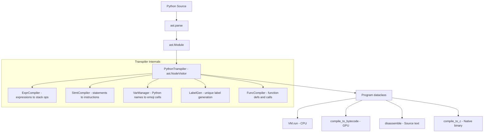

# Design: Python-to-EmojiASM Transpiler

## Overview

An `ast.NodeVisitor`-based transpiler that walks a Python AST and emits `Instruction` objects into `Function` containers, producing a `Program` dataclass identical to what `parse()` returns. Expressions compile to postfix (children visited before parent emits the operator). Control flow compiles to label+jump patterns. Variables map to emoji memory cells via a deterministic pool.

## Architecture



## Components

### Component A: `PythonTranspiler` (main class)

**Purpose**: Top-level transpiler that orchestrates AST walking and program assembly.

**Responsibilities**:
- Parse Python source via `ast.parse()`
- Walk `ast.Module` body, dispatching to statement/expression visitors
- Manage the current function context (which `Function` is being populated)
- Coordinate variable management, label generation, and function compilation
- Produce final `Program` with entry point `🏠`
- Validate imports (whitelist `random`, `math`)

**Interface**:
```python
class PythonTranspiler(ast.NodeVisitor):
    def __init__(self):
        self.program: Program
        self._current_func: Function
        self._vars: VarManager
        self._labels: LabelGenerator
        self._loop_stack: list[tuple[str, str]]  # (continue_label, break_label)
        self._functions: dict[str, FuncInfo]  # function metadata

    def transpile(self, source: str) -> Program: ...
```

### Component B: `VarManager` (variable-to-emoji mapping)

**Purpose**: Map Python variable names to unique emoji memory cell identifiers.

**Responsibilities**:
- Assign each unique Python variable name a unique emoji identifier
- Track which variables have been assigned (for error checking)
- Maintain separate scopes for different functions (prefixed to avoid collision)
- Provide deterministic mapping (same variable always gets same emoji)

**Strategy**: Use a pool of emoji characters, assigned in order of first use:

```python
EMOJI_POOL = [
    "🅰️", "🅱️", "🅾️", "🔴", "🟠", "🟡", "🟢", "🔵", "🟣", "🟤",
    "⬛", "⬜", "🔶", "🔷", "🔸", "🔹", "💎", "💠", "🔘", "⭕",
    "🌀", "🌟", "⭐", "🌙", "☀️", "🌈", "🔥", "💧", "🌊", "🍀",
    "🎵", "🎶", "🎯", "🎪", "🎭", "🎨", "🎬", "🎮", "🎰", "🎱",
    "📊", "📈", "📉", "📍", "📌", "🔑", "🔒", "🔓", "🗝️", "🧩",
]
```

For function-scoped variables, prepend function emoji to avoid collision:
- Module-level `x` -> `🅰️`
- `def foo` parameter `x` -> assigned within foo's scope, unique cell

**Interface**:
```python
class VarManager:
    def assign(self, name: str, func_scope: str = "🏠") -> str:
        """Assign or retrieve emoji cell for a Python variable name."""

    def lookup(self, name: str, func_scope: str = "🏠") -> str:
        """Get emoji cell for a variable. Raises TranspileError if unassigned."""

    def is_assigned(self, name: str, func_scope: str = "🏠") -> bool: ...
```

### Component C: `LabelGenerator`

**Purpose**: Generate unique emoji labels for control flow structures.

**Responsibilities**:
- Produce unique label names for if/else, while, for, break targets
- Ensure no collision between labels across nested control flow
- Use human-readable emoji for better disassembly output

**Strategy**: Counter-based with category prefixes:
- If/else: `🔀1`, `🏁1`, `🔀2`, `🏁2`, ...
- While: `🔁1`, `🏁1`, `🔁2`, `🏁2`, ...
- Generic: `⬇️1`, `⬇️2`, ...

Simplest approach: single counter, single prefix:
```python
class LabelGenerator:
    def __init__(self):
        self._counter = 0

    def next(self, prefix: str = "L") -> str:
        self._counter += 1
        return f"L{self._counter}"  # Simple: L1, L2, L3...
```

Using plain string labels avoids emoji encoding issues in label names. The labels are internal to the `Function.labels` dict and don't appear in output.

### Component D: `ExprCompiler` (expression visitor methods)

**Purpose**: Compile Python expression AST nodes to stack-based instructions.

**Responsibilities**:
- Visit expression nodes, emitting instructions that leave the result on top of stack
- Handle binary ops, unary ops, comparisons, boolean ops
- Handle function calls (`random.random()`, `print()`, user-defined)
- Handle `ast.Constant` (literals) and `ast.Name` (variable reads)

**Key Methods** (on `PythonTranspiler`):

```python
def visit_Constant(self, node: ast.Constant): ...  # PUSH literal
def visit_Name(self, node: ast.Name): ...           # LOAD variable
def visit_BinOp(self, node: ast.BinOp): ...         # left, right, OP
def visit_UnaryOp(self, node: ast.UnaryOp): ...     # operand, OP
def visit_BoolOp(self, node: ast.BoolOp): ...       # chained AND/OR
def visit_Compare(self, node: ast.Compare): ...     # comparison ops
def visit_Call(self, node: ast.Call): ...            # function calls
```

### Component E: `StmtCompiler` (statement visitor methods)

**Purpose**: Compile Python statement AST nodes to instruction sequences.

**Responsibilities**:
- Handle assignments, augmented assignments
- Handle if/elif/else with label+jump pattern
- Handle while loops with loop labels
- Handle for-range loops via decomposition
- Handle function definitions
- Handle return, break, expression statements
- Handle import statements (whitelist check)

**Key Methods** (on `PythonTranspiler`):

```python
def visit_Assign(self, node: ast.Assign): ...       # expr + STORE
def visit_AugAssign(self, node: ast.AugAssign): ... # LOAD + expr + OP + STORE
def visit_If(self, node: ast.If): ...               # labels + jumps
def visit_While(self, node: ast.While): ...         # loop labels + jumps
def visit_For(self, node: ast.For): ...             # decompose range()
def visit_FunctionDef(self, node: ast.FunctionDef): ...
def visit_Return(self, node: ast.Return): ...       # expr + RET
def visit_Break(self, node: ast.Break): ...         # JMP break_label
def visit_Expr(self, node: ast.Expr): ...           # expression statement
def visit_Import(self, node: ast.Import): ...       # whitelist check
def visit_ImportFrom(self, node: ast.ImportFrom): ...
```

## Data Flow

1. **Input**: Python source string
2. **Parse**: `ast.parse(source)` produces `ast.Module`
3. **Pre-scan**: Walk AST to collect function definitions and validate imports
4. **Compile main**: Visit top-level statements, emit instructions into `🏠` function
5. **Compile functions**: For each `def`, create a new `Function`, compile its body
6. **Finalize**: Add `HALT` to main function, assemble `Program`
7. **Output**: `Program` dataclass ready for VM/GPU/compiler

### Expression Compilation (Infix to Postfix)

The AST naturally encodes precedence. Recursive visiting produces postfix:

```
Python: (3 + 4) * 5
AST:    BinOp(BinOp(3, +, 4), *, 5)

Visit BinOp(*, ...):
  Visit BinOp(+, ...):
    Visit Constant(3)   -> emit PUSH 3
    Visit Constant(4)   -> emit PUSH 4
    emit ADD
  Visit Constant(5)     -> emit PUSH 5
  emit MUL

Result: PUSH 3, PUSH 4, ADD, PUSH 5, MUL  (correct postfix)
```

### Control Flow Compilation

#### If/Else Pattern

```python
if cond:       # compile cond -> JZ else_label
    body1      # compile body1 -> JMP end_label
else:          # else_label:
    body2      # compile body2
               # end_label:
```

```
[cond instructions]
JZ else_label
[body1 instructions]
JMP end_label
else_label:
[body2 instructions]
end_label:
```

#### If/Elif/Else Pattern

```python
if cond1:      # compile cond1 -> JZ elif_label
    body1      # compile body1 -> JMP end_label
elif cond2:    # elif_label: compile cond2 -> JZ else_label
    body2      # compile body2 -> JMP end_label
else:          # else_label:
    body3      # compile body3
               # end_label:
```

#### While Loop Pattern

```python
while cond:    # loop_label: compile cond -> JZ end_label
    body       # compile body -> JMP loop_label
               # end_label:
```

```
loop_label:
[cond instructions]
JZ end_label
[body instructions]
JMP loop_label
end_label:
```

#### For-Range Decomposition

```python
for i in range(n):     # i = 0; while i < n: body; i += 1
for i in range(a, b):  # i = a; while i < b: body; i += 1
for i in range(a, b, s): # i = a; while i < b: body; i += s
```

### Function Compilation

```python
def square(x):
    return x * x
```

Compiles to:
```
📜 square_emoji
  STORE x_cell     # pop argument from stack into x
  LOAD x_cell
  LOAD x_cell
  MUL
  RET
```

Caller:
```
PUSH 5
CALL square_emoji
# result (25) is now on stack
```

**Multi-parameter functions**: Arguments are pushed left-to-right by the caller, stored right-to-left by the callee (since stack is LIFO):

```python
def add(a, b):
    return a + b

result = add(3, 5)
```

Caller emits: `PUSH 3`, `PUSH 5`, `CALL add_emoji`
Callee starts: `STORE b_cell`, `STORE a_cell` (reverse order)

**Function name mapping**: Python function names to emoji identifiers. Use a separate pool:

```python
FUNC_EMOJI_POOL = ["🔲", "🔳", "🔵", "🟢", "🟡", "🔴", "🟣", "🟤", "⬛", "⬜"]
```

## Technical Decisions

| Decision | Options | Choice | Rationale |
|----------|---------|--------|-----------|
| Output format | Source text vs Program dataclass | **Program dataclass** | Avoids re-parsing; directly feeds VM/GPU/compiler. `disassemble()` exists for text output. |
| Variable mapping | Hash-based vs pool-based | **Pool-based** | Deterministic, debuggable, limited set ok for target programs |
| Label naming | Emoji vs string | **Simple strings** (L1, L2...) | Labels are internal to Function.labels dict; no need for emoji. Avoids encoding issues. |
| Division handling | Always float vs coerce for `/` | **Coerce for `/`** | Python `/` always produces float; emit `PUSH 1.0 MUL` before `DIV` when both operands might be int |
| Class design | Single class vs separate classes | **Single class** with internal methods | Simpler; `ast.NodeVisitor` pattern naturally groups everything |
| Scope handling | True scoping vs flat global | **Flat with prefixed names** | V1 simplicity; EmojiASM memory is global anyway |
| Error handling | Exceptions vs error list | **Exceptions** (`TranspileError`) | Matches `ParseError` pattern in parser.py; fail-fast is appropriate for compilation |
| `for range()` | Native support vs while decomposition | **While decomposition** | Minimal; range() is just sugar over while loop |
| Import validation | Static check vs runtime | **Static (at transpile time)** | Can reject unsupported imports before any code runs |
| Power operator `**` | Native loop vs skip | **Emit as loop or skip in V1** | Could do `PUSH x, DUP, MUL` for integer powers; skip general case for V1 |

## File Structure

| File | Action | Purpose |
|------|--------|---------|
| `emojiasm/transpiler.py` | **Create** | Main transpiler module: `PythonTranspiler`, `VarManager`, `LabelGenerator`, `TranspileError`, `transpile()`, `transpile_to_source()` |
| `emojiasm/__main__.py` | **Modify** | Add `--from-python` and `--transpile` CLI flags |
| `emojiasm/inference.py` | **Modify** | Add `execute_python()` method to `EmojiASMTool` |
| `emojiasm/__init__.py` | **Modify** | Export `transpile`, `transpile_to_source` |
| `tests/test_transpiler.py` | **Create** | Comprehensive transpiler tests |

## Module Design: `emojiasm/transpiler.py`

```python
"""Python-to-EmojiASM transpiler.

Compiles a numeric subset of Python to EmojiASM Program objects
via Python's ast module.

    from emojiasm.transpiler import transpile, transpile_to_source

    program = transpile("x = 3 + 4\\nprint(x)")
    source = transpile_to_source("x = 3 + 4\\nprint(x)")
"""

import ast
from .parser import Program, Function, Instruction
from .opcodes import Op

class TranspileError(Exception):
    """Raised when Python source cannot be transpiled."""
    def __init__(self, message: str, line_num: int = 0, col: int = 0):
        self.line_num = line_num
        self.col = col
        loc = f"Line {line_num}" if line_num else "Unknown location"
        super().__init__(f"Transpile error at {loc}: {message}")

class VarManager: ...
class LabelGenerator: ...

class PythonTranspiler(ast.NodeVisitor):
    # Expression visitors (visit_Constant, visit_Name, visit_BinOp, etc.)
    # Statement visitors (visit_Assign, visit_If, visit_While, etc.)
    # Function compilation (visit_FunctionDef, visit_Return, visit_Call)
    ...

def transpile(source: str) -> Program:
    """Transpile Python source to an EmojiASM Program."""
    return PythonTranspiler().transpile(source)

def transpile_to_source(source: str) -> str:
    """Transpile Python source to EmojiASM source text."""
    from .disasm import disassemble
    return disassemble(transpile(source))
```

## Operator Mapping

### Binary Operators (ast.operator -> Op)

| ast Node | Python | EmojiASM Op | Notes |
|----------|--------|-------------|-------|
| `ast.Add` | `+` | `Op.ADD` | |
| `ast.Sub` | `-` | `Op.SUB` | |
| `ast.Mult` | `*` | `Op.MUL` | |
| `ast.FloorDiv` | `//` | `Op.DIV` | Direct match (int//int = floor div) |
| `ast.Div` | `/` | `Op.DIV` | Need float coercion: emit `PUSH 1.0 MUL` on left operand first |
| `ast.Mod` | `%` | `Op.MOD` | |
| `ast.Pow` | `**` | N/A | V1: error or special-case integer powers |

### Comparison Operators (ast.cmpop -> Op sequence)

| ast Node | Python | EmojiASM Sequence |
|----------|--------|-------------------|
| `ast.Eq` | `==` | `CMP_EQ` |
| `ast.NotEq` | `!=` | `CMP_EQ`, `NOT` |
| `ast.Lt` | `<` | `CMP_LT` |
| `ast.Gt` | `>` | `CMP_GT` |
| `ast.LtE` | `<=` | `CMP_GT`, `NOT` |
| `ast.GtE` | `>=` | `CMP_LT`, `NOT` |

### Unary Operators

| ast Node | Python | EmojiASM Sequence |
|----------|--------|-------------------|
| `ast.USub` | `-x` | `PUSH 0`, visit x, `SUB` |
| `ast.UAdd` | `+x` | visit x (no-op) |
| `ast.Not` | `not x` | visit x, `NOT` |

### Boolean Operators

| ast Node | Python | EmojiASM Op |
|----------|--------|-------------|
| `ast.And` | `and` | Visit all values, chain with `AND` between each pair |
| `ast.Or` | `or` | Visit all values, chain with `OR` between each pair |

For `a and b and c`: visit a, visit b, `AND`, visit c, `AND`.

## Division Semantics

Python `/` always returns float. EmojiASM `DIV` does floor division when both operands are int. To match Python semantics:

For `ast.Div` (`/`):
1. Compile left operand
2. Emit `PUSH 1.0`, `MUL` (coerce to float)
3. Compile right operand
4. Emit `DIV`

This ensures the left operand is always a float, so VM's DIV takes the float path.

For `ast.FloorDiv` (`//`):
1. Compile left operand
2. Compile right operand
3. Emit `DIV` (direct; int//int = floor div is correct)

## Chained Comparisons

Python `a < b < c` means `(a < b) and (b < c)`. The AST represents this as:
```python
Compare(left=a, ops=[Lt, Lt], comparators=[b, c])
```

Compilation strategy:
1. Visit `a`
2. Visit `b`, DUP it (need b for both comparisons)
3. ROT to get `a, b_copy, b` -> actually need careful stack management
4. Emit `CMP_LT` for first comparison
5. SWAP with b_copy, visit `c`, emit `CMP_LT`
6. Emit `AND`

Simplified for V1: only support single comparisons (`a < b`). Chained comparisons with >1 operator raise `TranspileError` with suggestion to use `and`.

## Error Handling

| Error | Handling | User Impact |
|-------|----------|-------------|
| Unsupported syntax node | Raise `TranspileError` with node type and line | "Unsupported: list comprehension at line 5. Use a for loop instead." |
| Unsupported import | Raise `TranspileError` | "Unsupported import 'numpy'. Only 'random' and 'math' are supported." |
| Unassigned variable | Raise `TranspileError` | "Variable 'x' used before assignment at line 3." |
| Unsupported operator | Raise `TranspileError` | "Operator '**' not supported. Use multiplication for integer powers." |
| String literal in numeric context | Raise `TranspileError` | "String literals are not supported in expressions." |
| Too many variables | Raise `TranspileError` | "Too many variables (max 50). Simplify your program." |
| Chained comparison | Raise `TranspileError` | "Chained comparisons ('a < b < c') not supported. Use 'a < b and b < c'." |
| `print()` with no args | Emit PUSH of empty string + PRINTLN, or skip | No error; push newline |
| Non-constant `range()` arg | Allow (compile expression) | Works as long as expression is numeric |

## Existing Patterns to Follow

- **Error class pattern**: `TranspileError` mirrors `ParseError` in `parser.py:32-38` (includes line_num, descriptive message)
- **Program construction**: Same `Program(functions={...}, entry_point="🏠")` pattern as `parse()` returns
- **Instruction creation**: `Instruction(op=Op.X, arg=val, line_num=n, source=src)` -- source field set to Python source line for debugging
- **Module-level functions**: `transpile()` and `transpile_to_source()` mirror `parse()` as module-level convenience functions
- **CLI flag pattern**: `--from-python` follows existing `--compile`, `--disasm` flag patterns in `__main__.py`
- **Test pattern**: Tests use `run()` helper that calls `parse()` then `VM().run()` -- transpiler tests use same pattern but with `transpile()` instead of `parse()`
