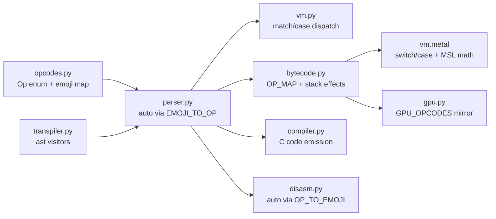

# Design: tier1-numeric-ops

## Overview

Additive extension of the EmojiASM opcode set with 9 math opcodes, following the established per-opcode pipeline pattern. Each new opcode mirrors the existing RANDOM opcode's integration pattern across all 7 pipeline layers. Transpiler additions use the existing `visit_Call` / `visit_BinOp` visitor pattern.

## Architecture



## Components

### Component 1: Opcode Definitions (opcodes.py)

**Purpose**: Single source of truth for Op enum values and emoji mappings.

**Changes**:

```python
# Add after RANDOM = auto() in Op IntEnum:
POW = auto()
SQRT = auto()
SIN = auto()
COS = auto()
EXP = auto()
LOG = auto()
ABS = auto()
MIN = auto()
MAX = auto()

# Add to EMOJI_TO_OP dict:
"🔋": Op.POW,
"🌱": Op.SQRT,
"📈": Op.SIN,
"📉": Op.COS,
"🚀": Op.EXP,
"📓": Op.LOG,
"💪": Op.ABS,
"⬇️": Op.MIN,
"⬇": Op.MIN,    # variation selector variant
"⬆️": Op.MAX,
"⬆": Op.MAX,    # variation selector variant
```

No OPS_WITH_ARG changes needed — all new ops are stack-only (no argument).

### Component 2: VM Execution (vm.py)

**Purpose**: Execute new opcodes in the Python VM.

**Stack effects**:

| Opcode | Pops | Pushes | Operation |
|--------|------|--------|-----------|
| POW | 2 (a, b) | 1 | `a ** b` |
| SQRT | 1 (a) | 1 | `math.sqrt(a)` |
| SIN | 1 (a) | 1 | `math.sin(a)` |
| COS | 1 (a) | 1 | `math.cos(a)` |
| EXP | 1 (a) | 1 | `math.exp(a)` |
| LOG | 1 (a) | 1 | `math.log(a)` |
| ABS | 1 (a) | 1 | `abs(a)` |
| MIN | 2 (a, b) | 1 | `min(a, b)` |
| MAX | 2 (a, b) | 1 | `max(a, b)` |

**Implementation pattern** (follows existing binary ops like SUB):

Binary ops (POW, MIN, MAX):
```python
case Op.POW:
    b, a = self._pop(), self._pop()
    self._push(a ** b)
```

Unary ops (SQRT, SIN, COS, EXP, LOG, ABS):
```python
case Op.SQRT:
    a = self._pop()
    self._push(math.sqrt(a))
```

**Error handling**: `math.sqrt` of negative raises `ValueError` in Python — let it propagate as VMError. `math.log(0)` raises `ValueError` — same treatment.

### Component 3: Bytecode Encoding (bytecode.py)

**Purpose**: Map new Op enum values to GPU bytecode numbers.

**Bytecode allocation** (extends arithmetic range 0x10-0x1D):

```python
# Add to OP_MAP:
Op.POW:   0x15,
Op.SQRT:  0x16,
Op.SIN:   0x17,
Op.COS:   0x18,
Op.EXP:   0x19,
Op.LOG:   0x1A,
Op.ABS:   0x1B,
Op.MIN:   0x1C,
Op.MAX:   0x1D,
```

**Stack effects** (add to `_STACK_EFFECTS`):

```python
Op.POW:  -1,  # pops 2, pushes 1
Op.SQRT:  0,  # pops 1, pushes 1
Op.SIN:   0,
Op.COS:   0,
Op.EXP:   0,
Op.LOG:   0,
Op.ABS:   0,
Op.MIN:  -1,  # pops 2, pushes 1
Op.MAX:  -1,  # pops 2, pushes 1
```

### Component 4: Metal Kernel (metal/vm.metal)

**Purpose**: GPU execution of new opcodes using MSL native math functions.

**Constant declarations**:

```metal
// Math functions (extends arithmetic range)
constant uint8_t OP_POW     = 0x15;
constant uint8_t OP_SQRT    = 0x16;
constant uint8_t OP_SIN     = 0x17;
constant uint8_t OP_COS     = 0x18;
constant uint8_t OP_EXP     = 0x19;
constant uint8_t OP_LOG     = 0x1A;
constant uint8_t OP_ABS     = 0x1B;
constant uint8_t OP_MIN     = 0x1C;
constant uint8_t OP_MAX     = 0x1D;
```

**Switch cases** (follow existing binary/unary patterns):

Binary math ops (POW, MIN, MAX) — follow OP_MUL pattern:
```metal
case OP_POW: {
    if (sp < 2) { status[tid] = STATUS_ERROR; running = false; break; }
    sp--;
    stack[sp - 1] = pow(stack[sp - 1], stack[sp]);
    break;
}
```

Unary math ops (SQRT, SIN, COS, EXP, LOG, ABS) — follow OP_NOT pattern (single operand):
```metal
case OP_SQRT: {
    if (sp < 1) { status[tid] = STATUS_ERROR; running = false; break; }
    stack[sp - 1] = sqrt(stack[sp - 1]);
    break;
}
```

### Component 5: GPU Glue (gpu.py)

**Purpose**: Mirror bytecode OP_MAP in GPU_OPCODES dict for validation.

```python
# Add to GPU_OPCODES:
"POW":    0x15,
"SQRT":   0x16,
"SIN":    0x17,
"COS":    0x18,
"EXP":    0x19,
"LOG":    0x1A,
"ABS":    0x1B,
"MIN":    0x1C,
"MAX":    0x1D,
```

### Component 6: C Compiler (compiler.py)

**Purpose**: Emit C code for new opcodes.

**Preamble change**: Add `#include <math.h>` to both `_PREAMBLE_NUMERIC` and `_PREAMBLE_MIXED`.

**Emission patterns** (in `_emit_inst`):

Binary ops (numeric-only path):
```python
elif op == Op.POW:
    if numeric_only:
        A('    { double b=POP(),a=POP(); PUSH_N(pow(a,b)); }')
    else:
        A('    { Val b=POP(),a=POP(); PUSH_N(pow(a.num,b.num)); }')
```

Unary ops (numeric-only path):
```python
elif op == Op.SQRT:
    if numeric_only:
        A('    { double a=POP(); PUSH_N(sqrt(a)); }')
    else:
        A('    { Val a=POP(); PUSH_N(sqrt(a.num)); }')
```

### Component 7: Transpiler (transpiler.py)

**Purpose**: Compile Python math expressions to EmojiASM opcodes.

#### 7a: Power operator (`**`)

In `visit_BinOp`, replace the `ast.Pow` error with:
```python
if isinstance(node.op, ast.Pow):
    self.visit(node.left)
    self.visit(node.right)
    self._emit(Op.POW, node=node)
    return
```

Also add to `_BINOP_MAP`:
```python
ast.Pow: Op.POW,
```

And `_AUGOP_MAP`:
```python
ast.Pow: Op.POW,
```

#### 7b: Math module functions

In `visit_Call`, add handling for `math.func(x)` attribute calls:
```python
# math.sqrt(x), math.sin(x), etc.
if (isinstance(node.func, ast.Attribute)
    and isinstance(node.func.value, ast.Name)
    and node.func.value.id == "math"):
    math_ops = {
        "sqrt": (Op.SQRT, 1),
        "sin":  (Op.SIN, 1),
        "cos":  (Op.COS, 1),
        "exp":  (Op.EXP, 1),
        "log":  (Op.LOG, 1),
    }
    if node.func.attr in math_ops:
        op, nargs = math_ops[node.func.attr]
        if len(node.args) != nargs:
            raise TranspileError(...)
        self.visit(node.args[0])
        self._emit(op, node=node)
        return
```

#### 7c: Builtins (abs, min, max)

In `visit_Call`, add handling:
```python
# abs(x)
if isinstance(node.func, ast.Name) and node.func.id == "abs":
    self.visit(node.args[0])
    self._emit(Op.ABS, node=node)
    return

# min(a, b), max(a, b)
if isinstance(node.func, ast.Name) and node.func.id in ("min", "max"):
    if len(node.args) != 2:
        raise TranspileError("min()/max() requires exactly 2 arguments")
    self.visit(node.args[0])
    self.visit(node.args[1])
    self._emit(Op.MIN if node.func.id == "min" else Op.MAX, node=node)
    return
```

#### 7d: Math constants

In `visit_Attribute`, add handling for `math.pi` and `math.e`:
```python
def visit_Attribute(self, node: ast.Attribute):
    if (isinstance(node.value, ast.Name) and node.value.id == "math"):
        if node.attr == "pi":
            self._emit(Op.PUSH, 3.141592653589793, node=node)
            return
        if node.attr == "e":
            self._emit(Op.PUSH, 2.718281828459045, node=node)
            return
    # existing pass-through
```

#### 7e: random.uniform(a, b) and random.gauss(mu, sigma)

**uniform(a, b)** = `a + (b - a) * random()`:
```python
# Inline expansion:
self.visit(node.args[0])  # a (kept for final ADD)
self.visit(node.args[1])  # b
self.visit(node.args[0])  # a again
self._emit(Op.SUB)        # b - a
self._emit(Op.RANDOM)     # random()
self._emit(Op.MUL)        # (b - a) * random()
self._emit(Op.ADD)        # a + (b - a) * random()
```

**gauss(mu, sigma)** = Box-Muller transform:
`mu + sigma * sqrt(-2 * log(u1)) * cos(2 * pi * u2)`
```python
# Inline expansion using new opcodes:
self._emit(Op.RANDOM)           # u1
self._emit(Op.LOG)              # log(u1)
self._emit(Op.PUSH, -2.0)
self._emit(Op.MUL)              # -2 * log(u1)
self._emit(Op.SQRT)             # sqrt(-2 * log(u1))
self._emit(Op.RANDOM)           # u2
self._emit(Op.PUSH, 6.283185307179586)  # 2*pi
self._emit(Op.MUL)              # 2*pi*u2
self._emit(Op.COS)              # cos(2*pi*u2)
self._emit(Op.MUL)              # sqrt(...) * cos(...)
self.visit(node.args[1])        # sigma
self._emit(Op.MUL)              # sigma * standard_normal
self.visit(node.args[0])        # mu
self._emit(Op.ADD)              # mu + sigma * ...
```

#### 7f: Chained comparisons

In `visit_Compare`, replace the error with generalized chained comparison support:

For `a op1 b op2 c op3 d`:
1. Visit a
2. For each (op_i, comparator_i):
   a. Visit comparator_i
   b. If not last: DUP, ROT (save value for next comparison)
   c. Emit comparison op for op_i
   d. If not first: emit AND to combine with previous result
   e. If not last: SWAP (bring saved value back to top for next pair)

```python
def visit_Compare(self, node: ast.Compare):
    self.visit(node.left)

    if len(node.ops) == 1:
        # Simple comparison (unchanged)
        self.visit(node.comparators[0])
        self._emit_cmp_op(node.ops[0], node)
        return

    # Chained: a op1 b op2 c ...
    for i, (cmp_op, comparator) in enumerate(zip(node.ops, node.comparators)):
        self.visit(comparator)
        is_last = (i == len(node.ops) - 1)

        if not is_last:
            self._emit(Op.DUP, node=node)    # save value for next comparison
            self._emit(Op.ROT, node=node)    # bring previous value to top

        self._emit_cmp_op(cmp_op, node)

        if i > 0:
            self._emit(Op.AND, node=node)    # combine with previous result

        if not is_last:
            self._emit(Op.SWAP, node=node)   # bring saved value back to top
```

Extract comparison emission to helper `_emit_cmp_op()` for reuse.

## Data Flow

1. Python source -> `ast.parse()` -> AST nodes
2. `visit_BinOp(Pow)` -> `Op.POW` instruction
3. `visit_Call(math.sqrt)` -> `Op.SQRT` instruction
4. `visit_Attribute(math.pi)` -> `Op.PUSH 3.14159...` instruction
5. `visit_Compare(chained)` -> multiple CMP + AND instructions
6. Instructions -> VM match/case dispatch OR bytecode -> Metal kernel OR C compiler

## Technical Decisions

| Decision | Options | Choice | Rationale |
|----------|---------|--------|-----------|
| Bytecode range | New range 0x70+ vs extend 0x1x | Extend 0x15-0x1D | Math ops are arithmetic — keep with arithmetic range |
| uniform/gauss | New opcodes vs inline expansion | Inline expansion | No new opcodes needed; uses existing + new math ops |
| ABS emoji | 📐 (conflict) vs 💪 | 💪 | 📐 already used for CMP_GT |
| MIN/MAX emoji | Various | ⬇️/⬆️ | Intuitive direction arrows, with variation selector variants |
| Chained cmp | Desugar in AST vs emit inline | Emit inline | Follows existing transpiler pattern; no AST rewriting |
| math.h include | Always vs conditional | Always | Trivial cost, simplifies logic |

## File Structure

| File | Action | Purpose |
|------|--------|---------|
| `emojiasm/opcodes.py` | Modify | Add 9 Op enum values + emoji mappings |
| `emojiasm/vm.py` | Modify | Add 9 match/case arms + `import math` |
| `emojiasm/bytecode.py` | Modify | Add 9 OP_MAP entries + _STACK_EFFECTS |
| `emojiasm/metal/vm.metal` | Modify | Add 9 opcode constants + switch cases |
| `emojiasm/gpu.py` | Modify | Add 9 GPU_OPCODES entries |
| `emojiasm/compiler.py` | Modify | Add 9 emit cases + `#include <math.h>` |
| `emojiasm/transpiler.py` | Modify | POW binop, math calls, constants, uniform/gauss, chained cmp |
| `emojiasm/disasm.py` | No change | Auto via OP_TO_EMOJI reverse map |
| `docs/REFERENCE.md` | Modify | Document new opcodes |
| `tests/test_emojiasm.py` | Modify | Tests for new EmojiASM opcodes |
| `tests/test_transpiler.py` | Modify | Tests for transpiler features |
| `tests/test_bytecode.py` | Modify | Tests for bytecode encoding |

## Error Handling

| Error | Handling | User Impact |
|-------|----------|-------------|
| `sqrt(negative)` | VM raises VMError | "SQRT of negative number" |
| `log(0)` or `log(negative)` | VM raises VMError | "LOG domain error" |
| `min()`/`max()` wrong arg count | TranspileError at compile time | "min()/max() requires exactly 2 arguments" |
| `math.unknown_func()` | TranspileError | "Unsupported math function: unknown_func" |
| GPU NaN/Inf from bad math | MSL returns NaN/Inf naturally | Result contains NaN/Inf (no crash) |

## Existing Patterns to Follow

- **Op enum**: New entries go after `RANDOM = auto()` in `opcodes.py:43`
- **EMOJI_TO_OP**: Add after `"🎲": Op.RANDOM` at line 87
- **VM dispatch**: New match arms after `case Op.RANDOM:` at line 286, using same `self._pop()`/`self._push()` pattern
- **Bytecode OP_MAP**: Add after `Op.RANDOM: 0x60` at line 67-68
- **Metal kernel**: Add opcode constants after `OP_RANDOM = 0x60` at line 62, switch cases after RANDOM case at line 621
- **GPU_OPCODES**: Add after `"RANDOM": 0x60` at line 71
- **C compiler**: Add `elif` arms after `Op.RANDOM` case at line 309, following same numeric_only/mixed branching pattern
- **Test pattern**: `run()` helper in test_emojiasm.py, `run_py()` helper in test_transpiler.py
