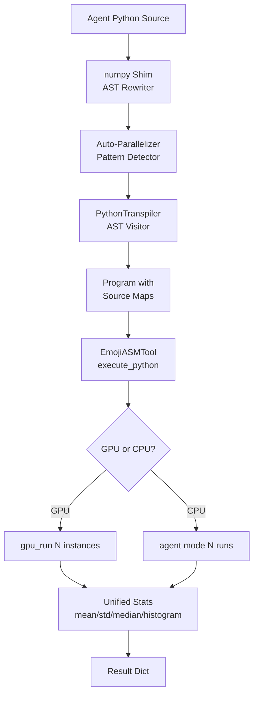

# Design: tier3-agent-experience

## Overview

Five components layered on the existing transpiler/inference pipeline: (1) AST-level numpy shim rewrites `np.*` calls before transpilation, (2) auto-parallelization detects single-instance patterns and wraps source, (3) unified stats module with median/histogram, (4) enriched error messages in transpiler, (5) source map population in transpiler `_emit()`.

## Architecture

## Components

### Component A: numpy Shim (AST Rewriter)
**Purpose**: Rewrite `np.*` calls to `math.*`/`random.*` equivalents before transpilation
**Location**: New function `_rewrite_numpy(tree: ast.Module) -> ast.Module` in `emojiasm/transpiler.py`
**Responsibilities**:
- Detect `import numpy as np` (or `import numpy`) in module imports
- Walk AST and replace:
  - `np.random.random()` -> `random.random()`
  - `np.random.normal(mu, sigma)` -> `random.gauss(mu, sigma)`
  - `np.random.uniform(a, b)` -> `random.uniform(a, b)`
  - `np.sqrt(x)` -> `math.sqrt(x)`
  - `np.abs(x)` -> `abs(x)`
  - `np.sin(x)` -> `math.sin(x)`
  - `np.cos(x)` -> `math.cos(x)`
  - `np.exp(x)` -> `math.exp(x)`
  - `np.log(x)` -> `math.log(x)`
  - `np.pi` -> `math.pi`
- Add synthetic `import random` and `import math` if not present
- Raise `TranspileError` with suggestion for unsupported `np.*` calls

### Component B: Auto-Parallelizer
**Purpose**: Detect single-instance Python and auto-wrap for N-instance execution
**Location**: New function `_auto_parallelize(source: str) -> str` in `emojiasm/transpiler.py`
**Responsibilities**:
- Parse AST and detect single-instance pattern:
  - Uses `random` (imports random or numpy random)
  - No large for-loops (range(N) where N is a literal > 100)
  - Has an assignable "result" expression (last expression or explicit `result = ...`)
- If detected, ensure the program ends with the result value on top of stack (so `HALT` captures it)
- The transpiler already emits `HALT` at end; auto-parallelization just ensures the result variable is loaded before `HALT`
- Called by `execute_python()` when `n > 1` and source looks parallelizable

### Component C: Unified Stats Module
**Purpose**: Single source of truth for result aggregation
**Location**: New file `emojiasm/stats.py`
**Responsibilities**:
- `compute_stats(values: list[float], histogram_bins: int = 10) -> dict`
- Returns: mean, std, min, max, count, median, histogram (edges + counts)
- Replace `inference.py._compute_stats()` and `gpu.py._stats()` with imports from this module

### Component D: Error Message Enrichment
**Purpose**: Add actionable suggestions to transpiler errors
**Location**: Modifications to `emojiasm/transpiler.py`
**Responsibilities**:
- Extend `_UNSUPPORTED_SYNTAX` dict with suggestion text
- Add suggestion context to `TranspileError` raises for:
  - List literals → suggest `[0.0] * N`
  - Non-range for loops → suggest `for x in range(N)`
  - Unsupported imports → suggest `random` + `math`
  - Unsupported function calls → suggest closest supported function
  - String literals in expressions → suggest `print()`

### Component E: Source Map Population
**Purpose**: Link EmojiASM instructions back to Python source lines
**Location**: Modifications to `emojiasm/transpiler.py` and `emojiasm/__main__.py`
**Responsibilities**:
- In `PythonTranspiler.__init__()`, store the original source lines
- In `_emit()`, populate `Instruction.source` with `self._source_lines[lineno - 1]` when available
- In CLI `--from-python --debug`, print source map to stderr before execution
- In `execute_python()`, optionally include source map in result dict

## Data Flow

1. Agent calls `execute_python(source, n=10000)`
2. Source is parsed as AST; numpy shim rewrites `np.*` calls
3. Auto-parallelizer checks if source is single-instance pattern; if so, ensures result capture
4. `PythonTranspiler` compiles to `Program`, populating `Instruction.source` with Python line text
5. Program is classified by GPU tier and routed to GPU or CPU
6. N instances execute; results collected into `list[float]`
7. Unified stats module computes mean/std/median/histogram
8. Result dict returned to agent

## Technical Decisions

| Decision | Options | Choice | Rationale |
|----------|---------|--------|-----------|
| numpy shim location | Separate preprocessor vs inline in transpiler | AST rewriter before transpiler | Clean separation, no coupling with visitor logic |
| Auto-parallel detection | Source regex vs AST analysis | AST analysis | Accurate pattern detection, handles edge cases |
| Stats module | Extend existing vs new file | New `stats.py` file | DRY: single source, imported by both gpu.py and inference.py |
| Result capture for auto-parallel | Explicit return injection vs last-expression capture | Last-expression capture with `result` variable fallback | Matches how agents naturally write code |
| Source map storage | Separate data structure vs Instruction.source field | Existing `Instruction.source` field | Already exists in dataclass, just needs population |

## File Structure

| File | Action | Purpose |
|------|--------|---------|
| `emojiasm/stats.py` | Create | Unified stats: mean, std, median, histogram |
| `emojiasm/transpiler.py` | Modify | numpy shim, auto-parallelizer, error suggestions, source maps |
| `emojiasm/inference.py` | Modify | Use unified stats, pass source maps in result, call auto-parallelize |
| `emojiasm/gpu.py` | Modify | Use unified stats from stats.py |
| `emojiasm/__main__.py` | Modify | Source map debug output for --from-python --debug |
| `tests/test_transpiler.py` | Modify | Tests for numpy shim, auto-parallel, error messages, source maps |
| `tests/test_stats.py` | Create | Tests for unified stats module |

## Error Handling

| Error | Handling | User Impact |
|-------|----------|-------------|
| `np.array([1,2,3])` | TranspileError with suggestion: "np.array not supported. Use `arr = [0.0] * N` for fixed-size arrays" | Agent gets clear alternative |
| `np.linalg.solve()` | TranspileError: "numpy.linalg not supported. Only np.random, np.sqrt, np.abs, np.sin, np.cos, np.exp, np.log, np.pi are available" | Agent knows exact scope |
| `import pandas` | TranspileError: "Unsupported import: 'pandas'. Only {'random', 'math', 'numpy'} are supported" | Agent self-corrects |
| `x = [1,2,3]` | TranspileError: "List literals not supported. Use `arr = [0.0] * N` for fixed-size arrays" | Agent restructures code |
| `for x in items:` | TranspileError: "Only `for x in range(N)` is supported" | Agent restructures loop |
| Auto-parallel fails detection | Falls through to normal transpilation (no wrapping) | Transparent fallback |

## Existing Patterns to Follow

- **Error handling**: `TranspileError(message, lineno)` pattern used throughout `transpiler.py`
- **AST visitor pattern**: `PythonTranspiler(ast.NodeVisitor)` with `visit_*` methods
- **Import handling**: `visit_Import`/`visit_ImportFrom` track imports in `self._imports` set
- **Math function mapping**: `_MATH_FUNC_MAP` dict in `visit_Call` maps func names to `Op` enums
- **Stats computation**: `_compute_stats()` in inference.py returns dict with mean/std/min/max/count
- **random distribution compilation**: `random.uniform()` and `random.gauss()` inline emission patterns in `visit_Call`
